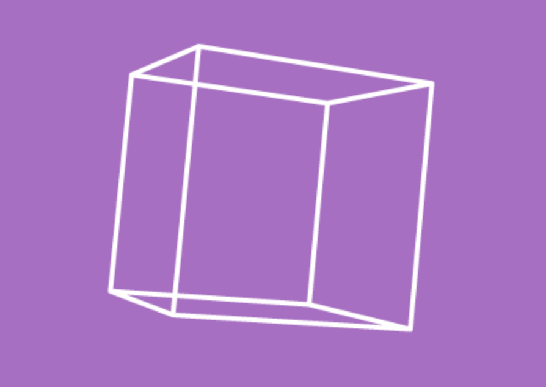

# 1 - Cube

This is a cube that you can can view from other angles as you move your head around.

For the first day, I thought I'd go back to basics and write as much as possible from scratch.

* The cube is a series of vector pairs (the one library I used was Sylvester for vector/matrix manipulation).
* The _renderer_ is more complex - this deals with drawing the image to the canvas and maintains transform matrices for the left/right eyes and a third one for the orientation of the cardboard.
* I used homogenous coordinates to allow translations and perspective (though for some reason the z transform doesn't do anything.)
* rotations are mega hacky, wouldn't be surprised if it doesn't work on other devices.
* It's nice and small - this is less than 5k. With Sylvester and the html, it still comes under 25k (gzip would improve further)

Things I learned:

* Three.js and rollup don't play as well as I'd expected. I tried to use the Matrix4 from Three - but it resulted in the entire of Three being included.  This makes me pretty sad because I'd been excited about using Three in a new, minimal way with rollup.  Hopefully it'll be fixed in the future.
* Sylvester is awesome - though I'd *love* to see something like it with an es6 (tree-shakable) approach
